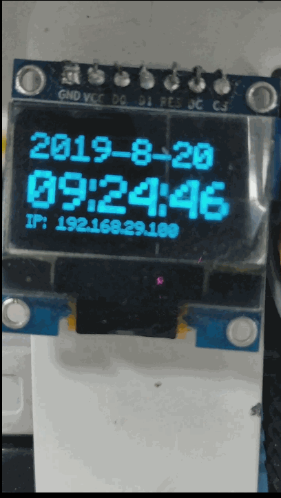

# OLED Timer

[TOC]

## Setup

```shell
$ sudo apt-get update
$ sudo apt-get install build-essential python-dev python-pip
$ sudo pip install RPi.GPIO
$ sudo apt-get install python-imaging python-smbus
$ sudo apt-get install git
$ git clone https://github.com/adafruit/Adafruit_Python_SSD1306.git
$ cd Adafruit_Python_SSD1306
$ sudo python setup.py install
```


## Run It

```shell
timer$ sudo python2 timer.py
```




