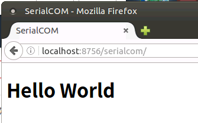

# Develop Start

  --

## *Overview*

[TOC]

## Contents

  ```
README
    Overview
    Contents
    TODO
    Note
    Change Log(2018)
        --
        
  ```


## TODO


## Note


## Change Log(2018)

### Dec/01


#### 23:xx create (django) server

```shell
web-serial/ $ django-admin startproject source
web-serial/ $ 
web-serial/ $ cd source && ./manage.py startapp serialcom
web-serial/ $ 
web-serial/ $ ./manage.py runserver
### test django could work ###
# !!! use "http://localhost:8000" on browser to check django server
# whether is running or not.
Ctrl+C  # quit django server
```


### Dec/02

#### 11:38 basic url setting

`source/ $ vim source/settings.py` :

```python
# SECURITY WARNING: don't run with debug turned on in production!
DEBUG = True

ALLOWED_HOSTS = ['*', ]


# Application definition
[...]
```

`vim source/urls.py` :

```python
--- a/web-serial/source/source/urls.py
+++ b/web-serial/source/source/urls.py
@@ -16,6 +16,13 @@ Including another URLconf
 from django.contrib import admin
 from django.urls import path
 
+from django.urls import include
+from django.http import HttpResponse
+
 urlpatterns = [
     path('admin/', admin.site.urls),
+
+    path("", lambda request: HttpResponse("-> /serialcom/ app is
 avaliable!")),
+
+    path("serialcom/", include("serialcom.urls")),
 ]
```

`vim serialcom/urls.py` :

```python
from django.urls import path

from . import views

urlpatterns = [
    path("", views.index, name="index"),
]
```

`vim serialcom/views.py` :

```python
--- a/web-serial/source/serialcom/views.py
+++ b/web-serial/source/serialcom/views.py
@@ -1,3 +1,8 @@
 from django.shortcuts import render
 
 # Create your views here.
+from django.http import HttpResponse
+
+
+def index(request):
+    return HttpResponse("Hello World!")
```


#### 16:16 add basic serial usage

depend on pyserial package. (`pip3 install pyserial`)

create `serialcom/serial` folder.

**Usage (test):**

```shell
(web-serial) joseph@linux:source$ python ./serialcom/serial/josser.py 
[Debug: ['/dev/ttyUSB0', 'USB-Serial Controller', 'USB VID:PID=067B:2303 LOCATION=1-1']]
[Debug: Serial Name = /dev/ttyUSB0]

[Debug: ['/dev/ttyAMA0', 'ttyAMA0', '20201000.serial']]
[Debug: Serial Name = /dev/ttyAMA0]

==== END for

<class 'set'>
{'/dev/ttyUSB0', '/dev/ttyAMA0'}

Choose a Serial device to Open:
	Do you want to open "/dev/ttyUSB0"? Enter Y/n (yes/no) to choose: n

	Do you want to open "/dev/ttyAMA0"? Enter Y/n (yes/no) to choose: n

[Debug: your final choose Serial Name = ""]
(web-serial) joseph@linux:source$
```


#### 21:06 add `/serialcom/` HTML index

1. 设置 `settings.py` 添加 `serialcom` 这个 “app”

    ```python
    --- a/web-serial/source/source/settings.py
    +++ b/web-serial/source/source/settings.py
    @@ -37,6 +37,8 @@ INSTALLED_APPS = [
         'django.contrib.sessions',
         'django.contrib.messages',
         'django.contrib.staticfiles',
    +
    +    'serialcom.apps.SerialcomConfig',
     ]
    
     MIDDLEWARE = [
    ```

2. 创建 `serialcom/templates/serialcom/` 文件夹，并且添加 `index.html`

    ```html
    {# source/serialcom/templates/serialcom/index.html #}
    <!DOCTYPE html>
    <html>
    <head>
        <title>SerialCOM</title>
    </head>
    <body>
        <h1>Hello World</h1>
    </body>
    </html>
    
    ```

3. 修改 views.py 使用 index.html response:

    ```python
    --- a/web-serial/source/serialcom/views.py
    +++ b/web-serial/source/serialcom/views.py
    @@ -1,8 +1,9 @@
     from django.shortcuts import render
     
     # Create your views here.
    -from django.http import HttpResponse
    +# from django.http import HttpResponse
     
     
     def index(request):
    -    return HttpResponse("Hello World!")
    +    return render(request, 'serialcom/index.html',
    +                  {})
    
    ```

启动 django server： `python3 manage.py runserver 0.0.0.0:8756`

浏览器输入路径即可查看：



