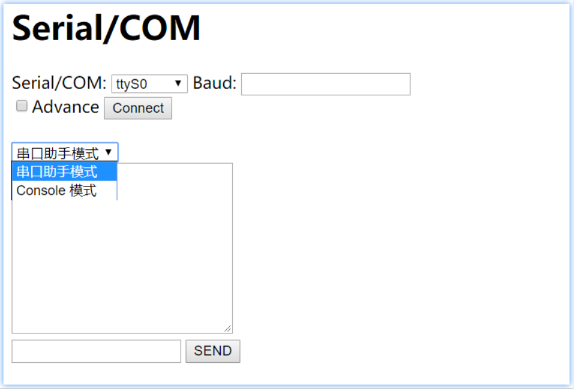

# Use Serial

  --

## *Overview*

[TOC]

## Contents

  ```
README
    Overview
    Contents
    TODO
    Note
    Change Log(2018)
        --
        
  ```


## TODO


## Note


## Change Log(2018)

### Dec/03

#### select Serial?/COM?

##### basic serialcom-UI



##### Template Serial/COM select

```html
[...]
<body>
	<h1>Serial/COM</h1>

	<form action="" method="POST">
		<div>
			<label>Serial/COM:</label>
			<select>
				<option>ttyS0</option>
				<option>ttyAMA0</option>
				<option>ttyUSB0</option>
			</select>

			<label>Baud:</label>
			[...]
```

​ ​ :point_up_2: 这是 hard-code for now.


修改 HTML 使用 django 模板系统

```html
[...]
<body>
	<h1>Serial/COM</h1>

	<form action="" method="POST">
		<div>
			<label>Serial/COM:</label>
			<select>
				<option>Select one Device</option>
			
				<option>{{ device }}</option>
			
			</select>

			<label>Baud:</label>
[...]
```

需要传递一个 serial 实例，这个 实例的类中有 `.devices` attribute, 后面的 HTML 模板中还会使用这个实例的其它 attribute 对应 serial/COM 的 configuration.

在 views.py load HTML 处的传递该实例代码：

```python
[...]
from .serial.josser import SerialCOM

def index(request):
    serial = SerialCOM()
    serial.devices = ["ttyS0", "ttyAMA0", "ttyUSB0", ]
    return render(request, 'serialcom/index.html',
                  {'serial': serial}, )
```

`SerialCOM` 类在 `serial/josser.py` 中定义

```python
#### filename: josser.py
class SerialCOM():
    devices = []

    def __init__(self):
        pass

```

暂时不需要太多内容。

##### Serial/COM select by read device

使用 `@classmethod` 直接调用类方法来返回类本身；在类方法中，读取 device 信息。

使用：

```python
--- a/web-serial/source/serialcom/views.py
+++ b/web-serial/source/serialcom/views.py
@@ -6,7 +6,6 @@ from .serial.josser import SerialCOM
 
 
 def index(request):
-    serial = SerialCOM()
-    serial.devices = ["ttyS0", "ttyAMA0", "ttyUSB0", ]
+    serial = SerialCOM.init()
     return render(request, 'serialcom/index.html',
                   {'serial': serial}, )

```

使用 `@classmethod` 实现的 init 函数：

```python
class SerialCOM():
    devices = []
    [...]

    @classmethod
    def init(cls):
        # cls.devices = ["ttyS0", "ttyAMA0", "ttyUSB0", ]
        portList = list(serial.tools.list_ports.comports())
        serial_name_set = set()
        for i in range(len(portList)):
            portList_coder = list(portList[i])
            serial_name_set.add(portList_coder[0])

        cls.devices = [_serialname for _serialname in serial_name_set]

        return cls()
```

这样刷新浏览器获 select 中得到的是真实的设备信息。


### Dec/04

#### handler POST

为了使浏览器载入 HTML 后 POST 带有数据，需要在 form 中指定要 POST 的字段的 id/name:

```html
[...]
	<h1>Serial/COM</h1>

	<form action="" method="POST">
		<div>
			<label>Serial/COM:</label>
			<select name="device_select" id="device_select">
				<option>Select one Device</option>
			
				<option>{{ device }}</option>
			
			</select>

			<label>Baud:</label>
			<input type="text" name="baud" id="baud"
			       value="9600"/>
			<br/>

			<input type="checkbox" name="advance"
			       value="advance">Advance
			<input type="submit" name="connect"
			       id="connect" value="Connect"/>
		</div>
		
	</form>
```

django server 接收处理 POST：

```python 
def index(request):
    if request.method == 'POST':
        if __debug__:
            print(request.POST['baud'], file=sys.stderr)
            print(request.POST['device_select'], file=sys.stderr)
        return HttpResponse("POST OK")
    elif request.method == 'GET':
        serial = SerialCOM.init()
        return render(request, 'serialcom/index.html',
                      {'serial': serial}, )
    else:
        pass  # not support.
```

可以点击浏览器的 ”Connect“ 按钮，看 server 的 terminal 上是否有 POST 过来的 debug 数据输出。

预期浏览器会变为”POST OK“页面。

#### change "Connect" value of `type="button"`

修改 `type="submit"` 为 `type="button"` ，然后添加 JavaScript function 测试 JavaScript 修改该 button 的 value：

```html
			<input type="button" name="connect" id="connect"
			       value="Connect" onclick="connect_serial()" />
```

JavaScript 修改button value 实现：

```javascript
[...]
<head>
	<title>SerialCOM</title>

<script type="text/javascript">
	function connect_serial(){
		var IsConnected = true;
		if (IsConnected == true){
			document.getElementById("connect").value = "disconnect";
		}
	}
</script>
</head>
```

#### post "Connect" request by Ajax

这里使用 Ajax 来 POST serial 数据以请求 Connect，根据 Response 是否成功（"True"/"False"）来修改 `id = "connect"` button.

```javascript
<script type="text/javascript">
/**
 * utils function:
 */
function sleep(ms) {
  return new Promise(resolve => setTimeout(resolve, ms));
}

	async function waitBack2ConnectText() {
	  await sleep(3000);
	  document.getElementById("connect").value = "Connect";
	}

	function connect_serial(){
		var xmlhttp;
		if (window.XMLHttpRequest){ //  IE7+, Firefox, Chrome, Opera, Safari 浏览器执行代码
		    xmlhttp=new XMLHttpRequest();
		}else{ // IE6, IE5 浏览器执行代码
		    xmlhttp=new ActiveXObject("Microsoft.XMLHTTP");
		}
		
		xmlhttp.open("POST", "/serialcom/", true);
		xmlhttp.setRequestHeader("Content-type","application/x-www-form-urlencoded");
		xmlhttp.send("device_select=/dev/ttyUSB0&baud=115200" +
                     "&csrfmiddlewaretoken=" +
                     document.getElementsByName("csrfmiddlewaretoken")[0].value);

		var IsConnected = ""
		xmlhttp.onreadystatechange=function(){
			if (xmlhttp.readyState==4 && xmlhttp.status==200){
				IsConnected = xmlhttp.responseText;
			}
		}

		if (IsConnected == "True"){
			document.getElementById("connect").value = "disconnect";
		}else{
			document.getElementById("connect").value = "FAIL connect!";
			waitBack2ConnectText();
		}
	}
</script>
```

> Reference: [菜鸟教程 - AJAX - 向服务器发送请求请求](http://www.runoob.com/ajax/ajax-xmlhttprequest-send.html)

注意，这里是直接在上面 [change "Connect" value of `type="button"`](#change "Connect" value of `type="button"`) 的

`<input type="button" ... id="connect" ... onclict="connect_serial()" />` 

的 function 中修改。上面的  [change "Connect" value of `type="button"`](#change "Connect" value of `type="button"`) 只是示例如何修改 button 上显示的 value，而非我们最终目标的功能内容。

> 其它注意点：
>
> 1. line 24~line 26 为了简单起见，起先做了 hard-code value，后来 POST 的时候，django 需要验证 CSRF，所以又使用了 JavaScript 的字符串 "+" 拼接的简单方式。
> 2. 正如上述，自己构造 POST 表单 value 的时候，需要带上 CSRF 验证。
> 3. 使用了 Promise + setTime() 实现的 sleep() 函数，不必深究，模仿使用即可。


现在使用 Ajax POST 选择的 serial/COM 和 输入的 baud，等待服务器响应 ”True“/”False“，views.py 中处理 POST 代码：

```python
def index(request):
    if request.method == 'POST':
        if __debug__:
            print(request.POST['baud'], file=sys.stderr)
            print(request.POST['device_select'], file=sys.stderr)
        return HttpResponse("False")
        # return HttpResponse("True")
    elif request.method == 'GET':[...]
```

这段 post 代码也并非最终功能，主要是现在手动修改 “False”/“True” 的请求，来观察浏览器上是否能成功修改 button 字样。


#### 实现真正的 Connect/Disconnect

1. 添加一个 `handler_serial.py` 文件，用于独立的进程打开 serial/COM 通信。

2. django 的 views.py 接收到 浏览器的 request 请求之后，通过 IPC 和 `handler_serial.py` 的进程通信。

3. `serialcom/index.html` 页面的 Connect/Disconnect button 按下之后，使用 Ajax 和 django server 通信。添加了 Connect/Disconnect 两个功能。

> 目前暂时不设 `Serial` 的 timeout -- 阻塞方式。在浏览器 select Serial/COM 要选择正确，可以打开的 serial，否则 `handler_serial.py` 将会 hang 住。
>
> Windows 平台亦完全可以使用。可以使用虚拟串口辅助测试。


### Dec/05 接收串口及显示

#### 20:15 Ajax 请求串口数据并显示

创建一个 `/serialcom/recive/` 用于请求接收数据:

```python
urlpatterns = [
    path("", views.index, name="index"),

    path("connect/", views.connect, name="connect"),
    path("recive/", views.recive, name="recive"),
]
```

views.py 中处理该请求暂时返回假的数据用于测试前端功能：

```python
def recive(request):
    if request.method == "GET":
        if request.GET["read"] == "read":
            msg = {
                "type": "recv",
                "length": int(request.GET["length"]),
            }
        else:
            print("request with wrong data", file=sys.stderr)

        if __debug__:
            print(msg, file=sys.stderr)

        recv = "*" * (int(request.GET["length"]) - 2) + "\r\n"
        return HttpResponse(recv)
```

前端添加一个 button，点击即发送请求接收串口数据：

```javascript
			<textarea name="serial_recv" id="serial_recv"
			       rows="10" cols="30">
			</textarea>
			<br/>
			<input type="button" name="click_to_recv" id="click_to_recv"
			       value="Click to Recive" onclick="click2recv()" />
			<script>
				function click2recv(){
					var xmlhttp_recv;
					if (window.XMLHttpRequest){ //  IE7+, Firefox, Chrome, Opera, Safari 浏览器执行代码
					    xmlhttp_recv=new XMLHttpRequest();
					}else{ // IE6, IE5 浏览器执行代码
					    xmlhttp_recv=new ActiveXObject("Microsoft.XMLHTTP");
					}
					
					xmlhttp_recv.open("GET",
						              "/serialcom/recive/?read=read&length=" +
						              Math.trunc(Math.random()*10), true);
					xmlhttp_recv.send();

					var str_recv = ""
					xmlhttp_recv.onreadystatechange=function()
					{
						if (xmlhttp_recv.readyState==4 && xmlhttp_recv.status==200){
							str_recv = xmlhttp_recv.responseText;
							document.getElementById("serial_recv").value += str_recv;
						}
					}
				}
			</script>
```


#### 20:38 接收真实的串口数据

```python
def recive(request):
    if request.method == "GET":
        if request.GET["read"] == "read":
            msg = {"type": "recv",
                   "length": int(request.GET["length"]), }
        else:
            print("request with wrong data", file=sys.stderr)

        if __debug__:
            print(msg, file=sys.stderr)

        client_conn = Client(("127.0.0.1", 27446), authkey=b'serialcom')
        client_conn.send(msg)

        recv = client_conn.recv()
        client_conn.close()

        return HttpResponse(recv)
```

在链接上串口之后，点击页面上的 "Click to Receive" 来接收数据。

此时会在启动 django 的终端上打印如 `{'length': 8, 'type': 'recv'}` ; 根据长度在测试链接的串口发送任意想要发送的该长度的字符测试浏览器显示。

> 开发测试阶段 views.py 将接收到的 request 数据做了打印输出来调试。
>
> 前端代码中可以看出，每次请求接收的字符长度是随机的。写成固定长度当然也可以。


