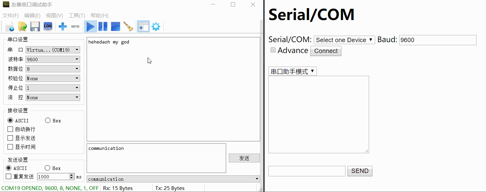

# Web Serial

**网页版串口（调试）助手**

<p align="right">powered by django</p>

## *Overview*

[TOC]


## Setup

download "web-serial/"

```powershell
> python -V
Python 3.x.x

> pip -V
....python 3.x.x
> pip install --user pyserial
> pip install --user django
```


## Usage

```
> cd web-serial
web-serial\ > cd source
source\ > dir
[...]
Directory of <path>\<to>\web-serial\source

...   <DIR>           .
...   <DIR>           ..
...             2,535 handler_serial.py
...             2,668 manage.py
...   <DIR>           serialcom
...   <DIR>           source 

source\ > python manage.py runserver

```

会自动弹出浏览器打开 SerialCOM 这个 web-serial 应用。

然后就可以使用了 :point_down:



<p align="middle">左侧使用桌面版串口助手测试；右侧为本 Web 版串口助手</p>


